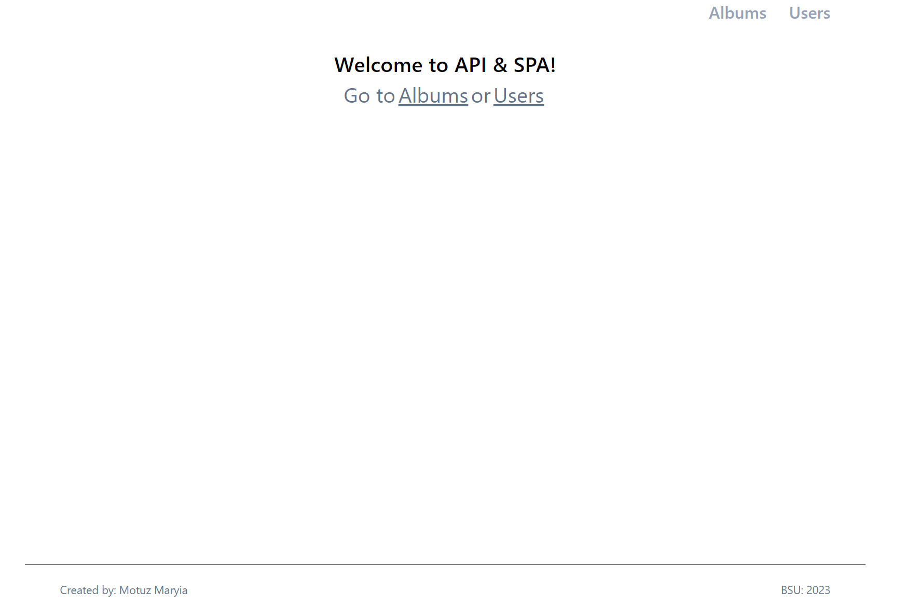
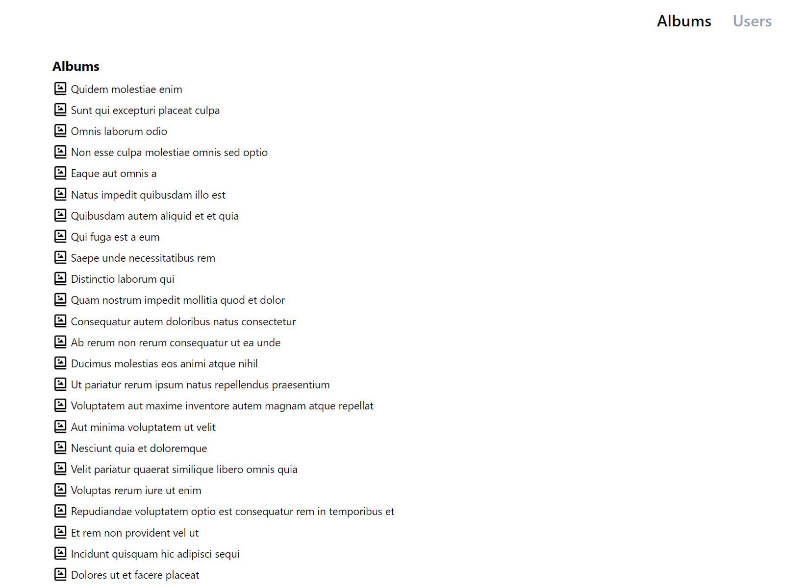
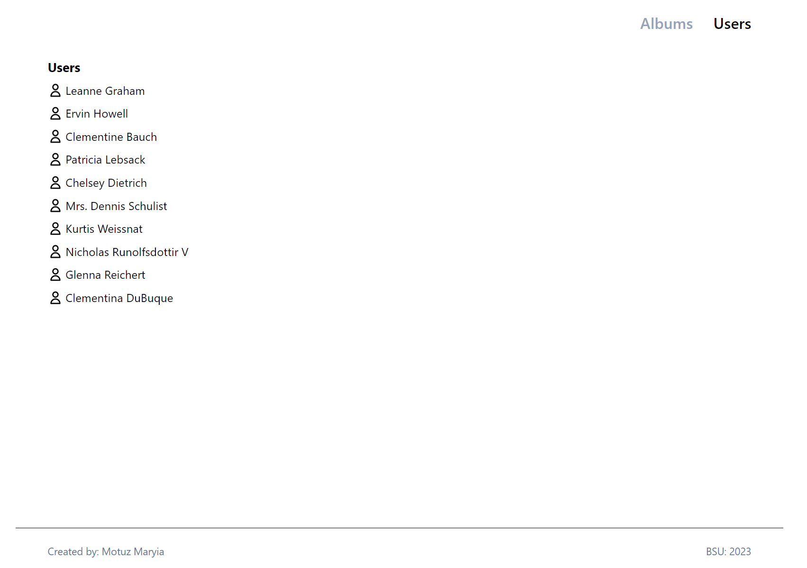

# SPA & API

This project is a multi-page application built using React and the react-router-dom library. It utilizes the JSONPlaceholder API (https://jsonplaceholder.typicode.com/) for data retrieval.

## Preview on Desktop

## Pages

1. User List Page
2. User Details Page
3. Album List Page
4. Album Details Page
5. 404 Page

Each page serves a specific purpose in the application and provides different functionalities and views for the users.

## Technologies

- React
- react-router-dom for routing
- CSS Modules for styling

Feel free to explore the application and navigate between different pages to view user and album information!

